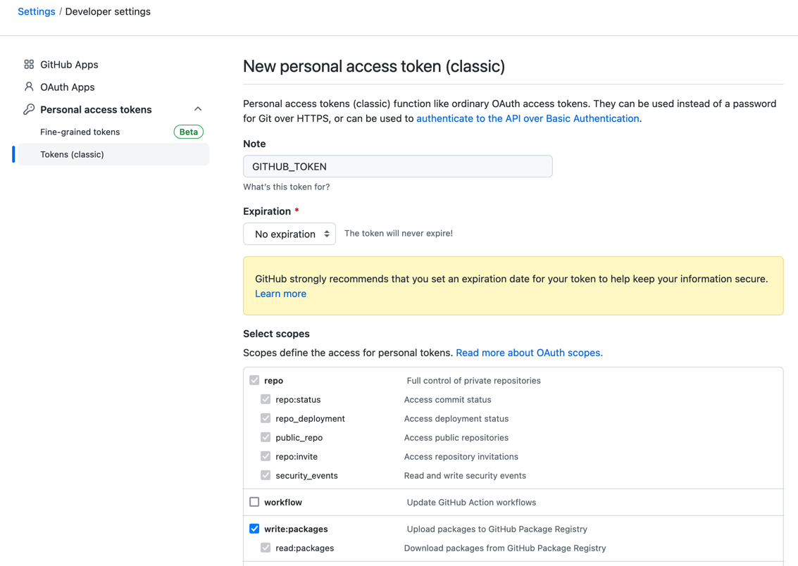

# CI CD

## Introduction

- `Semantic release` help us to automates the whole package release workflow including:
  - Determining the next version number,
  - Generating the release notes,
  - Publishing the package.
- New features and fixes are `immediately` available to users on Staging repository.
- Use formalized `commit message convention` to document changes in the codebase.

## Credentials

### Github Token



Then, this environment variable is ready to use `${{ secrets.GITHUB_TOKEN }}`.

### Public/Private Key

```shell
$ gpg --full-gen-key
$ gpg --list-keys
$ gpg --keyserver keyserver.ubuntu.com --send-keys 193EAE47
$ gpg --export-secret-keys 193EAE47 | base64
```

Configure values for:
```properties
SIGNING_KEY_ID = 193EAE47
SIGNING_PASSWORD = password
SIGNING_KEY = gpg --export-secret-keys 193EAE47 | base64
```

### Actions Secrets

Create these actions secrets used by release process:


## Repository Manager

The artifacts are deployed to Sonatype OSSRH (Sonatype Open Source Software Repository Manager).

These are the repositories availables:
- Snapshots: https://s01.oss.sonatype.org/content/repositories/snapshots
- Staging: https://s01.oss.sonatype.org/content/repositories/staging
- Releases: https://s01.oss.sonatype.org/content/repositories/releases


## Release Process

- Every push to pre-release branches `beta` deploy an artifact to `snapshots repository` and it's ready to be used.
- Every push to release branches `main`, `maintenance` deploy an artifact to `staging repository` and it's ready to be used.
- If there are no restrictions/problems/impediments next step is release the artifact to `maven central`.
- There is needed a `manual release` to send the libraries to `maven central`.
- In case of issues/problems/errors there is a `Drop` options available to delete the release version.
- Once a component has been released and published to the Central Repository, it cannot be altered.


## Artifacts

- Github Artifacts:
  - https://github.com/substrait/sustrait-java/releases

- Sonatype OSSRH Artifacts:
  - https://s01.oss.sonatype.org/content/repositories/{snapshots,staging,releases}/substrait/substrait-java/core/1.0.0/

## Branches Configuration

- In case of new features or breaking changes create a branch with any format name.
  Example:
  ```shell
  # Current version on production: 2.5.7
  $ git checkout -b new_feature_1234 main
  ```
  After your PR is merged to main branch, you could see the new libraries available at Sonatype staging environment.


- In case of maintenances please create a branch name with this pattern `+([0-9])?(.{+([0-9]),x}).x`.
  Example:
  ```shell
  # Current version on production: 2.5.7, version planned to use for maintenance: 2.1.7
  $ git checkout -b 2.1.x v2.1.7 # for fix
  $ git checkout -b 2.x v2.1.7 # for maintenance
  ```
  After your PR is merged to main branch, you could see the new libraries available at Sonatype staging environment.


- In case you need to experiment with breaking change functionalities for new feature, take a look at pre-release branch.
  Example:
  ```shell
  # Current version on production: 2.5.7, version planned to use for maintenance: 2.1.7
  $ git checkout -b new_feature_lots_changes beta
  ```
  After your PR is merged to main branch, you could see the new libraries available at Sonatype snapshots environment.


Branches configuration:

```json
  "branches": [
    // maintenances (also generate release)
    { "name": "+([0-9])?(.{+([0-9]),x}).x" },
    // release
    { "name": "main" },
    { "name": "next" },
    { "name": "next-major" },
    // pre-release
    { "name": "beta", "prerelease": true },
    { "name": "alpha", "prerelease": true }
  ],
```

## Q&A

#### 1. What will be happened if I merge something on `main` branch and finalize with errors?

CICD has a token configure with granted access to create issues as needed:

```shell
[10:30:55 PM] [semantic-release] [@semantic-release/github] › ℹ  Created issue #3: https://github.com/substrait/sustrait-java/issues/3.
```


#### 2. Could be possible to implement a process to deliver a library with custom version (i.e.: 3.2.9.RC1, 5.0.0.M1)?

We are using Sonatype OSSRH and there are repositories for `snapshots` / `staging` / `release`:
- If your library finalize with `1.4.3-XXXXX-SNAPSHOT` -> it is going to be deployed to Snapshots repository
- If your library finalize with `1.4.3-XXXXX-SNAPSHOT.YYYY` -> it is going to be deployed to Staging/Releases repository
- If your library finalize with `1.4.3-XXXXX` -> it is going to be deployed to Staging/Releases repository
- If your library finalize with `1.4.3` -> it is going to be deployed to Staging/Releases repository

#### 2. How many days do I have to approve the artifacts on the Staging repository?

Please review [OSSRH-24751](https://issues.sonatype.org/browse/OSSRH-24751)
